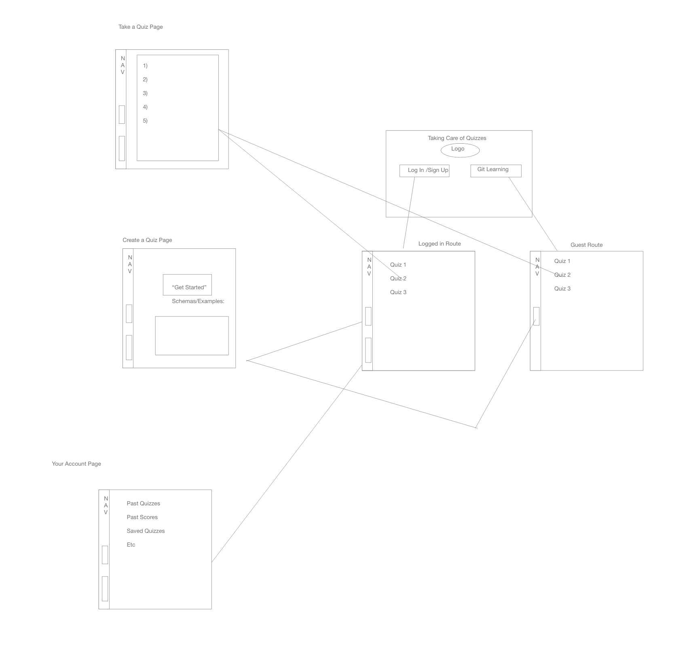

# Project Title:
Taking Care of Quizness

# Team Members:
Tasha, Connor, Nick F, Nick L

# Project Description:
MVP:
For your project users will be able to take quiz’s ie “What book are you”, “Which Harry Potter house you belong to” etc…  and at the same time users that are logged in will be able to create a quiz and post it for others to take.

# Nice to have:
Users who have posted quizzed can see how many people have clicked on their quiz.
Users can favorite quizzes to come back to them on their page

# Sketch: 

 
# Breakdown of tasks: 
Create folder structure
Setup server

Assign tasks for front-end
-Setup react routes
-Make components
-Setup pages, “Homepage” “Create Quiz Page” etc…

Assign tasks for back-end
-User authentication 
-Setup database
-Post and Get routes
-Deploy with Heroku

Polish front-end
